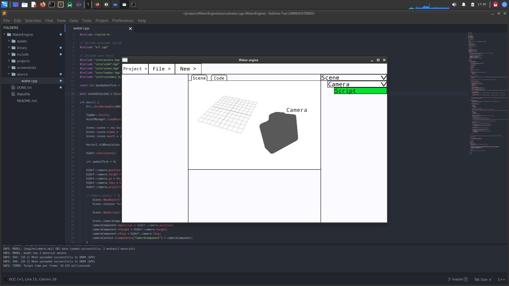
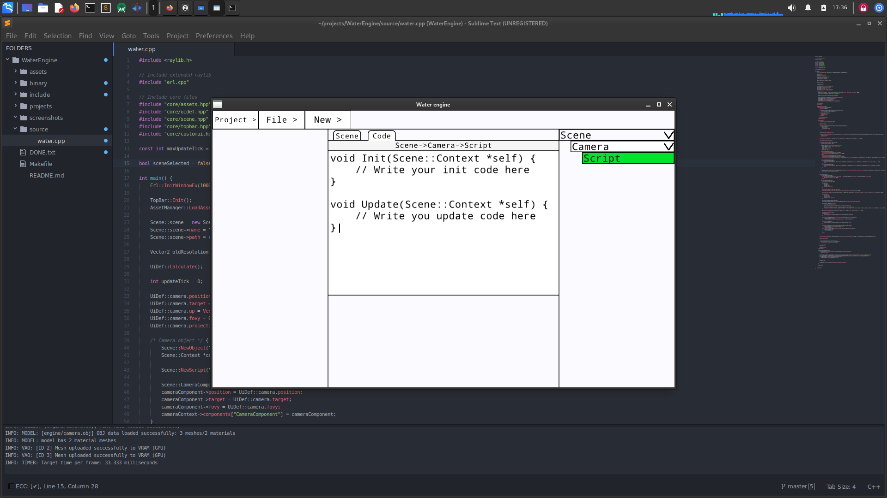

# Water engine
A simple game engine made using raylib.

 

## How to install?
1) Clone this repo and "CD" into it
`git clone https://github.com/Zahon7/Water-engine && cd Water-Engine`

2) Build it
`make`

3) Run it
`binary/water`
